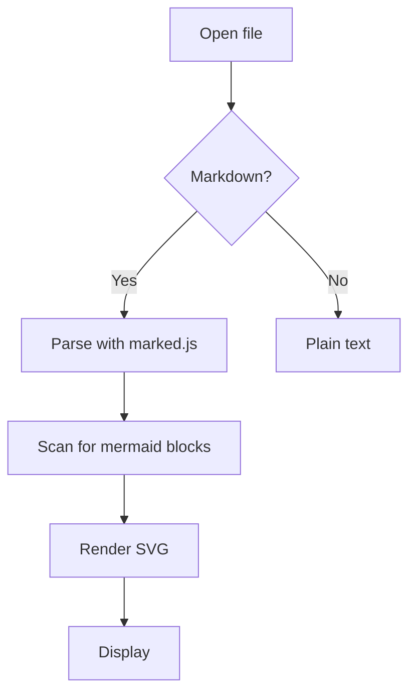
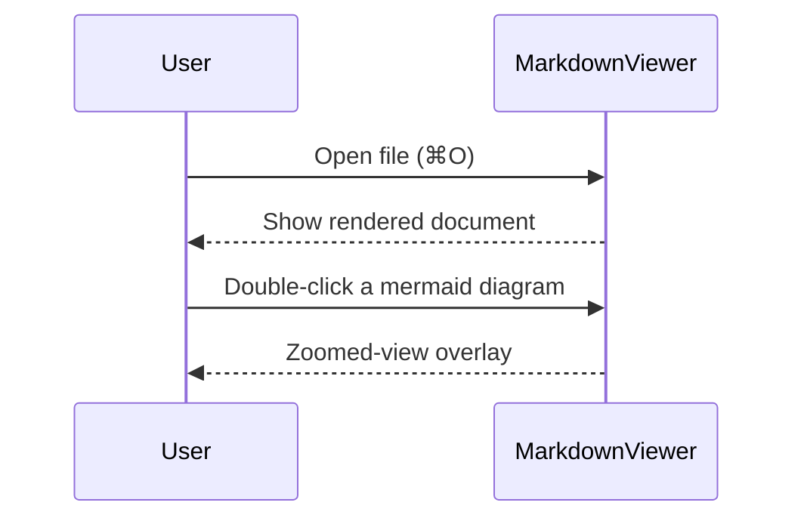

# MarkdownViewer Help

A native markdown viewer for macOS. Open a file and it renders immediately
as a formatted document, with in-place editing whenever you need it.
Mermaid diagrams are drawn automatically and can be expanded to full
screen with a double-click for zooming or editing, and local SVG images
are shown inline too. You can open a GitHub file URL, view and edit it,
and commit (push) straight back to the original repository, plus export
to PDF/HTML/Word/Markdown/draw.io. Built for developers and teams who
work with technical docs, READMEs, and diagrams in markdown every day.

## Opening files

- **File > Open (⌘O)**, the Dock icon/Recent Documents, or double-click a
  `.md` file in Finder
- Command line: `mdv file.md` (the bundled `mdv` script) or
  `open -a MarkdownViewer file.md`
- **Drag & drop**: drop a `.md` file onto the window to open it in a new
  window (multiple files at once work too)

## Opening from a URL / Pushing to GitHub

**File > Open from URL...** (⇧⌘O) downloads and opens the markdown file
at the URL you enter (https only).

- **Web server URL**: fetches the file for viewing/editing (pushing back
  isn't possible).
- **GitHub file (blob) URL**: paste a `github.com/.../blob/...` address
  as-is and it's automatically converted to its raw-content equivalent.
  Blob URLs from an internal GitHub Enterprise instance
  (`github.daumkakao.com`) work the same way.

A document opened from GitHub can be edited (⌘E) and then committed back
to its original repository via **File > Push to GitHub...** (⌥⌘P).

1. The first time you push, you'll be asked for a **personal access
   token** (with repo contents write access) for that host — the token is
   **stored in the macOS Keychain** and won't be asked for again (you can
   delete it any time from Keychain Access.app).
2. Enter a **commit message** and it's committed to that branch.
3. If the file has already changed on GitHub's side (a conflict), the push
   is rejected and you're told to reload the latest version with ⌘R,
   re-apply your edit, and push again.

For a URL-backed document, **⌘R (Reload)** re-downloads from the original
URL rather than reading the local cache. ⌘S only saves to the local cache
file — you need to push to actually update GitHub. Once a token is stored
in the Keychain, opening and reloading a private repository's files are
authenticated automatically too.

## Change notifications / reloading

If another app (an editor, `git checkout`, a build script, etc.) changes
the `.md` file you're currently viewing, a **"File changed on disk"**
banner appears at the top. It doesn't auto-refresh (so your scroll
position doesn't jump unexpectedly) — click the banner's **Reload**
button, or use File menu > **Reload** (⌘R), to pick up the latest content
whenever you're ready. ⌘R also works as a manual force-reload at any time,
banner or not.

## Mermaid diagrams

- ` ```mermaid ` code blocks are automatically rendered as diagrams
- **Double-click** a diagram to open it at full window size (small
  diagrams scale up to fit too)
  - Mouse wheel (no modifier) or two-finger scroll: pan around
  - **Control**+mouse wheel or trackpad pinch: zoom in/out centered on the
    cursor
  - Drag: pan around
  - **Enter**: fit the whole diagram to the window (same as the Fit
    button)
  - **⌘Enter**: fit only the width to the window (same as the Fit Width
    button, and the same action as ⌘9)
  - Top-right toolbar: − / + / Fit / **Source** / **Export ▾** / close, or
    press **Esc** to close
- Syntax errors show an error message in place of the diagram

### Jumping between diagrams

If a document has two or more Mermaid diagrams, the zoomed-view toolbar
also shows previous/next buttons (‹ 2/5 ›) and a **List** button.

- **← / →** (arrow keys) or the toolbar's ‹ / › buttons: jump straight to
  the previous/next diagram (wraps around from the last diagram back to
  the first)
- **List**: shows every diagram in the document as a grid of small
  previews. The one you're currently viewing is outlined in blue; click
  another to jump straight to it. **Esc** closes the list and returns you
  to the diagram you were viewing (it doesn't close the whole overlay).

### Viewing / copying the raw Mermaid source

The toolbar's **Source** button shows the actual code you wrote after the
` ```mermaid ` fence, instead of the rendered diagram — in a monospaced
font with aligned lines, and you can drag to select and copy it directly.
Press it again, or **Esc**, to go back to the diagram (this doesn't close
the overlay itself — press Esc once more to close it). The **Copy** button
in the top-right of the source block copies the entire source to the
clipboard in one action (same as **Export ▾ > Copy Source to Clipboard**).

### Editing Mermaid diagrams (Edit + Sync)

The toolbar's **Edit** button (or **⌘E** while zoomed in) opens a source
editor on the left with the diagram on the right. Fix the source on the
left, then press **Sync** (or **⌘Enter**) to apply it to the diagram on
the right — changes aren't applied live as you type, precisely so errors
don't flash on screen every time the syntax is briefly broken mid-edit.
If there's a syntax error, it's shown below the editor and the diagram
keeps showing its last valid state.

A synced change is reflected both in the diagram on the document view and
in the document's own source, so a subsequent **⌘S save** or export
includes your edit. **Esc** closes the editor and returns to the (edited)
diagram view.

## Document edit mode (split screen)

**File > Toggle Edit Mode** (⌘E) splits the window in two — a raw
markdown editor on the left, a rendered preview on the right.

- Typing on the left updates the preview on the right automatically after
  a brief pause (0.3s), including Mermaid diagrams.
- The preview **auto-scrolls to follow your cursor position** on the
  left, so what you're editing stays visible on the right. Scrolling on
  the left alone also carries the right side along.
- **⌘S** saves to the file. The file isn't touched until you save.
- Pressing ⌘E again closes the editor and returns to the normal view
  (your edits stay on screen; saving is still needed to write them to
  disk).
- Tab inserts 2 spaces.

Find (⌘F), export, clipboard copy, and Mermaid double-click zoom (along
with its own Edit/Sync) all keep working while in edit mode.

## Zooming the whole document

| Action | How |
|--------|-----|
| Zoom in | ⌘= or ⌘/Control+scroll up |
| Zoom out | ⌘- or ⌘/Control+scroll down |
| Reset to actual size | ⌘0 |
| **Fit to window width** | **⌘9** |
| Trackpad pinch | pinch/spread with two fingers |

Scrolling the mouse wheel with no modifier scrolls the page up/down as
usual.

**⌘9 (Fit to window width)** is the same shortcut whether you're viewing
the document or a zoomed-in Mermaid diagram.

- **Document view**: scales automatically to the window's width. On wide
  screens the content zooms in to fill the space edge-to-edge; on narrow
  windows it scales down so nothing gets clipped.
- **Mermaid zoomed view**: fits only the diagram's **width** to the
  window (not its height). If the diagram is taller than the window, drag
  or scroll to see the rest as usual. Use the regular **Fit** button (or
  Enter) if you want both dimensions fitted at once — Fit Width is more
  useful when fitting both directions would make a tall diagram (like a
  long sequence diagram) shrink too much.

## Find

**⌘F** opens a find bar in the top-right corner. As you type, every match
in the document is highlighted in yellow, with the current match shown in
a darker orange.

- **⌘G** / **⇧⌘G**: jump to the next / previous match
- The find bar's ↓ / ↑ buttons do the same thing
- **Esc**: close the find bar (clears the highlights too)

**Whitespace-tolerant matching**: a match doesn't need to be character-
for-character identical to be found — line breaks or runs of whitespace
in the document don't block a match. For example, if the source text has
irregular spacing across a line break, searching for the same words with
normal spacing still finds it, because both the search term and the
document are compared with runs of whitespace collapsed to one space.
This also works while viewing the raw source.

## Jumping to the start/end of the document

**Home** / **End** jump straight to the very beginning/end of the
document. The same actions are available from the View menu ("Scroll to
Top" / "Scroll to Bottom"). While the find bar has focus, Home/End behave
normally as cursor movement instead.

## Aligning text-art diagrams

ASCII box-drawing diagrams (│─┌═ etc.), even ones mixed with non-Latin
text, render in a monospaced font (D2Coding) automatically — without
needing a code fence — so their columns stay aligned.

## Behavior when launched without a document

If you launch the app without specifying a document (clicking the Dock
icon, opening with no file, etc.), exactly one behavior runs, chosen in
**MarkdownViewer > Settings...** (⌘,):

- **Show Help** (default): this Help window opens.
- **Show Open dialog**: the file-open dialog appears.
- **Do nothing (just launch the app)**: no window opens at all (the app
  still appears in the Dock, just with no window — use File > Open... or
  the Recent Files menu to open something directly).

Exactly one of the three runs; the other two don't.

## Recent files count

The "Open Recent" setting in **MarkdownViewer > Settings...** (⌘,)
controls how many entries the File menu's "Open Recent" list remembers
(default 10, range 1–50). Changes apply starting with the next file you
open.

## Viewing SVG files

`.svg` files can also be opened directly with this app (via the CLI,
drag & drop, or the "Open With" menu). Unlike markdown, though, it isn't
registered as the default SVG viewer automatically (so as not to override
macOS's default SVG handler) — open one explicitly with
`open -a MarkdownViewer diagram.svg`, or pick it directly from Finder's
"Open With".

## Embedding SVG in a markdown document

Referencing a local `.svg` file inside a markdown document with
`` inlines the SVG's actual content at that
spot (real vector graphics, not just an image link). Both relative paths
(`./sub/diagram.svg`) and parent-directory paths (`../diagram.svg`) work,
and the content is re-read fresh every time the document is opened,
saved, or reloaded.

If the file can't be found or read, a clickable placeholder (🖼
description) is shown instead — clicking it opens the target in a new
window or the system's default app, following the "Linked document
open behavior" setting below. `http://`/`https://` image links are
unaffected by this feature and behave as before.

Inlined SVGs can be **double-clicked** to open at full window size, just
like Mermaid diagrams — zoom/pan, drag to move, Fit/Fit Width, viewing the
source, exporting to PNG/JPG, all work the same as the Mermaid zoomed
view (though since an SVG is already finished artwork, Edit and draw.io
export aren't offered for it).

An SVG reference added while live-previewing in edit mode may not be
inlined immediately — saving or reopening the document picks it up.

## Linked document open behavior setting

What happens when you click a link in the document (a relative, absolute,
or `file://` link to another `.md`/`.svg` file) can be changed under
"Linked Documents" in **MarkdownViewer > Settings...** (⌘,):

- **Open directly in MarkdownViewer** (default): if the link points to a
  file this app can open (md/markdown/svg, etc.), it opens directly in a
  new window. Any other file type automatically falls back to the
  system's default app.
- **Open with the system default app**: always opens with whatever app
  macOS has assigned as the default.

`http://`, `https://`, `mailto:`, and in-document anchor (`#`) links are
always handled by the default browser/mail app or by scrolling within the
page, regardless of this setting.

## Setting as the default app

**MarkdownViewer menu > "Set as Default Markdown App"** registers this
app so double-clicking a `.md`/`.markdown` file always opens it here.

## Exporting to PDF

File menu > **"Export as PDF..."** (⇧⌘E) saves the document exactly as
currently rendered (including Mermaid diagrams) to a PDF. You'll be
prompted for a save location, and a long document spans multiple pages.

## Exporting Mermaid diagrams (PNG / JPG / draw.io)

Open a diagram's zoomed view by double-clicking it, then use the
toolbar's **"Export ▾"** menu to pick one of four options.

- **Copy to Clipboard**: places the image on the clipboard so you can
  paste it directly with **⌘V** into a wiki or document editor — the
  fastest option since there's no separate save/upload step (works out
  of the box with most editors that accept pasted images, like Confluence
  or Notion).
- **PNG**: saves a high-resolution (2×) image file with a transparent
  background.
- **JPG**: saves an image file with the background filled in white.
- **draw.io**: converts flowcharts to editable shapes, as described
  below.

To export every Mermaid diagram in the document at once, use File menu >
**"Export as draw.io (Whole Document)..."** — this saves a single
`.drawio` file with each diagram on its own page (PNG/JPG can only export
one diagram at a time).

Flowcharts are converted into real, individually movable/editable shapes
in draw.io (positions match the rendered layout; shape types map to
Mermaid's syntax — rectangles, diamonds, circles, etc.). Other diagram
types like sequence diagrams don't support shape conversion yet, so
they're inserted as an image — movable and resizable in draw.io, but not
editable element by element.

### Pasting an editable diagram into Confluence

Even without a Mermaid macro in Confluence (most internal Confluence
instances instead use the **draw.io/diagrams.net macro**), you can still
insert a fully editable diagram using the `.drawio` file created above.

1. In the Mermaid zoomed-view toolbar > Export ▾ > **Save as draw.io...**
   (or from the File menu for the whole document at once)
2. In the Confluence page editor, insert the **draw.io** (diagrams.net)
   macro via "+" or "/"
3. In the macro's edit screen, use **File > Import from...** (or the
   "Import" button) and pick the `.drawio` file you just saved
4. Save, and you get a live Confluence diagram whose boxes and arrows can
   be moved and edited directly

## Pasting the whole document into a wiki

File menu > **"Copy to Clipboard (for Wiki Paste)"** (⇧⌘C) places the
entire document on the clipboard in two formats at once.

- **Rich text (HTML)**: headings, bold, tables, code blocks, etc. keep
  their formatting, and Mermaid diagrams are embedded inline as images.
  Wiki editors that accept pasted images (Confluence, Notion, etc.) get
  the formatting and diagrams intact with a single **⌘V**.
- **Plain text (raw markdown)**: if the target can't accept rich text, the
  original `.md` syntax is pasted as-is — editors that understand
  markdown (like Notion) often auto-convert it into formatting on paste.

The target app picks whichever format it accepts, so you can just paste
without thinking about which one applies.

## Exporting to a file (HTML / Word / Markdown)

The File menu can save the whole document to a file. All three embed
Mermaid diagrams as inline images, so the result opens standalone without
the original file.

- **Export as HTML...**: a self-contained `.html` file that opens
  directly in a browser. Formatting (headings, bold, tables, code blocks)
  is kept via inline styles.
- **Export as Word (.doc)...**: a `.doc` file that opens in Microsoft
  Word. It isn't a true `.docx` (OOXML) — it's an HTML document wrapped in
  a format Word recognizes, a long-standing and widely-supported
  technique — so it opens fine in both Word and Pages with formatting and
  images intact. Word may show a one-time "this file's format doesn't
  match its extension" confirmation on first open; that's expected.
- **Export as Markdown...**: saves the raw `.md` text of the currently
  open document to another location, unchanged.

## Viewing the source

**View menu > "View Source"** (⌘⌥U, the same shortcut Safari/Chrome use
for View Page Source) shows the raw markdown text instead of the rendered
document. Press it again, or **Esc**, to return to the rendered view.
Exporting or copying to clipboard while viewing the source always exports
the *rendered* result — whatever the export produces doesn't depend on
which view you happen to be looking at.

## Keyboard shortcut summary

| Shortcut | Action |
|----------|--------|
| ⌘O | Open file |
| ⇧⌘O | Open from URL |
| ⌘R | Reload (re-downloads for URL-backed documents) |
| ⌘E | Toggle edit mode — split editor in document view, diagram editor while zoomed into Mermaid |
| ⌘S | Save |
| ⌥⌘P | Push to GitHub |
| ⌘F | Find |
| ⌘G / ⇧⌘G | Find next / previous |
| Home / End | Jump to start / end of document |
| ⇧⌘E | Export as PDF |
| ⇧⌘C | Copy document to clipboard (for wiki paste) |
| ⌘⌥U | Toggle source view |
| ⌘= | Zoom document in |
| ⌘- | Zoom document out |
| ⌘0 | Reset document zoom |
| ⌘9 | Fit to window width (document or Mermaid) |
| ⌘? | Open this Help |
| ← / → | (while zoomed into Mermaid) previous/next diagram |
| Enter | (while zoomed into Mermaid) fit to window |
| ⌘Enter | (while zoomed into Mermaid) fit width / (while editing Mermaid) Sync |
| Esc | Context-dependent: close the diagram list, exit source view, close the find bar, or close the Mermaid zoomed view |

## Examples

Copy the examples below into your own `.md` file to try them out.

### Basic syntax

**Bold**, *italic*, `inline code`, [a link](https://example.com)

- List item 1
- List item 2
  - Nested item

| Feature | Status |
|---------|--------|
| Markdown | Supported |
| Mermaid | Supported |

### Flowchart example



### Sequence diagram example



Double-click either diagram to view it scaled to fit this window.
