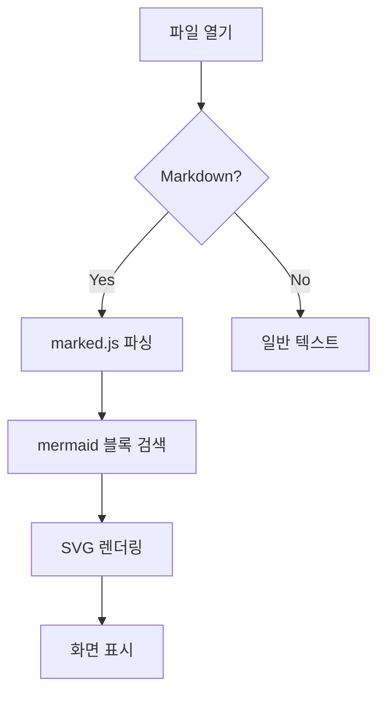
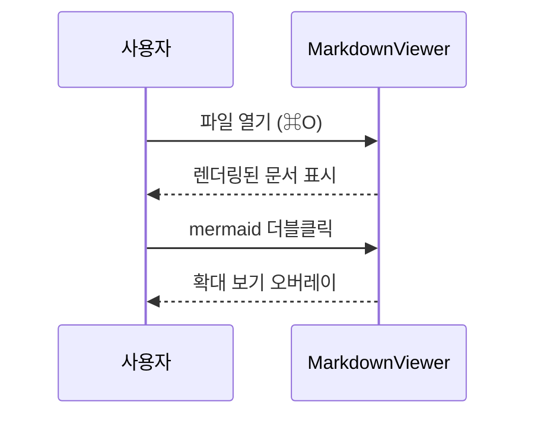

# MarkdownViewer 도움말

macOS용 네이티브 마크다운 뷰어입니다. 파일을 열면 바로 서식 있는 문서로
렌더링하고, 필요하면 그 자리에서 편집도 할 수 있습니다. Mermaid 다이어그램을
자동으로 그려주고 더블클릭으로 전체 화면 확대/편집까지 지원하며, 로컬 SVG
이미지도 인라인으로 보여줍니다. GitHub 파일 URL을 열어 바로 보고 편집한 뒤
원래 저장소에 커밋(푸시)할 수 있고, PDF/HTML/Word/Markdown/draw.io로
내보내기도 됩니다. 마크다운으로 기술 문서·README·다이어그램을 자주 다루는
개발자와 팀을 위한 도구입니다.

## 파일 열기

- **File > Open (⌘O)**, Dock 아이콘/최근 문서, 또는 Finder에서 `.md` 더블클릭
- 커맨드라인: `mdv 파일.md` (동봉된 `mdv` 스크립트) 또는 `open -a MarkdownViewer 파일.md`
- **드래그 & 드롭**: 창 위에 `.md` 파일을 끌어다 놓으면 새 창으로 열림 (여러 개 동시 가능)

## URL로 열기 / GitHub로 푸시

**File > Open from URL...** (⇧⌘O)에 마크다운 파일의 URL을 넣으면
다운로드해서 바로 열어줍니다 (https 전용).

- **웹서버 URL**: 파일을 받아서 보기/편집할 수 있습니다 (푸시는 불가).
- **GitHub 파일(blob) URL**: `github.com/.../blob/...` 주소를 그대로
  붙여넣으면 raw 주소로 자동 변환해 가져옵니다. 사내 GitHub Enterprise
  (`github.daumkakao.com`)의 blob 주소도 동일하게 동작합니다.

GitHub에서 연 문서는 편집(⌘E) 후 **File > Push to GitHub...** (⌥⌘P)로
원래 저장소에 커밋할 수 있습니다.

1. 처음 푸시할 때 해당 호스트용 **개인 액세스 토큰**(repo contents 쓰기
   권한)을 물어봅니다 — 토큰은 macOS **Keychain에 저장**되어 다시 묻지
   않습니다 (Keychain Access 앱에서 삭제 가능).
2. **커밋 메시지**를 입력하면 해당 브랜치에 커밋됩니다.
3. 파일이 GitHub 쪽에서 먼저 바뀌어 있으면(충돌) 푸시가 거부되고, ⌘R로
   최신본을 다시 받아 수정 후 푸시하라고 안내합니다.

URL로 연 문서에서 **⌘R(다시 읽기)**은 로컬 캐시가 아니라 원래 URL에서
**다시 다운로드**합니다. ⌘S 저장은 로컬 캐시 파일에만 저장되며, GitHub에
반영하려면 푸시해야 합니다. 비공개 저장소는 토큰이 Keychain에 저장된
뒤부터 열기/다시 읽기에도 자동으로 인증이 붙습니다.

## 파일이 바뀌면 알려줌 / 다시 읽기

다른 앱(에디터, `git checkout`, 빌드 스크립트 등)이 지금 보고 있는 `.md`
파일을 바꾸면, 화면 위에 **"파일이 변경되었습니다"** 배너가 뜹니다.
자동으로 새로고침하지는 않으므로(읽던 위치가 갑자기 바뀌지 않도록),
필요할 때 배너의 **"새로고침"** 버튼을 누르거나 File 메뉴 >
**"다시 읽기"** (⌘R)를 누르면 최신 내용을 다시 불러옵니다. 언제든
(배너가 없어도) ⌘R로 강제 새로고침할 수 있습니다.

## Mermaid 다이어그램

- \`\`\`mermaid 코드블록은 자동으로 다이어그램으로 렌더링됩니다
- **더블클릭**하면 다이어그램이 창 전체 크기로 열립니다 (작게 그려진 그림도 화면에 맞춰 확대)
  - 마우스 휠(수정키 없이) 또는 두 손가락 스크롤: 상하좌우 이동
  - **Control**+마우스 휠 또는 트랙패드 핀치: 커서 위치 중심으로 확대/축소
  - 드래그: 상하좌우 이동
  - **Enter**: 화면에 꽉 차게 자동으로 맞춤(맞춤 버튼과 동일)
  - **⌘Enter**: 가로 폭만 창에 맞춤(Fit Width 버튼과 동일, ⌘9와 같은 동작)
  - 우상단 툴바: − / + / 맞춤 / **Source** / **내보내기 ▾** / 닫기, 또는 **Esc**로 닫기
- 문법 오류가 있으면 다이어그램 자리에 오류 메시지가 표시됩니다

### 다른 다이어그램으로 바로 이동

문서에 mermaid 다이어그램이 2개 이상이면 확대 보기 툴바에 이전/다음
이동 버튼(‹ 2/5 ›)과 **List** 버튼이 추가로 나타납니다.

- **← / →** (화살표 키) 또는 툴바의 ‹ / › 버튼: 이전/다음 다이어그램으로
  바로 이동 (마지막에서 다음으로 가면 처음으로 순환)
- **List**: 문서 안의 모든 다이어그램을 작은 미리보기와 함께 격자로
  보여줍니다. 지금 보고 있는 다이어그램은 파란 테두리로 표시되고,
  다른 걸 클릭하면 바로 그 다이어그램으로 이동합니다. **Esc**로 닫으면
  보던 다이어그램으로 돌아갑니다(오버레이 자체는 닫히지 않습니다).

### 원본 mermaid 소스 보기 / 복사

툴바의 **Source** 버튼을 누르면 그림 대신 `\`\`\`mermaid` 뒤에 실제로
적었던 원본 코드가 그대로 표시됩니다 — 고정폭 글꼴이라 줄이 맞고,
드래그해서 직접 선택/복사할 수도 있습니다. 다시 누르거나 **Esc**를
누르면 다이어그램으로 돌아갑니다(오버레이 자체는 닫히지 않습니다 —
Esc를 한 번 더 누르면 그때 오버레이가 닫힙니다). 소스 블록 우상단의
**Copy** 버튼을 누르면 전체 소스가 한 번에 클립보드로 복사됩니다
(**내보내기 ▾ > Copy Source to Clipboard**와 동일).

### Mermaid 편집 (Edit + Sync)

툴바의 **Edit** 버튼(또는 확대 보기 중 **⌘E**)을 누르면 좌측에 소스 편집기, 우측에 다이어그램이
나란히 열립니다. 좌측에서 소스를 고친 뒤 **Sync** 버튼(또는 **⌘Enter**)을
누르면 우측 다이어그램에 반영됩니다 — 타이핑 중 문법이 잠깐 깨질 때마다
오류가 번쩍이지 않도록, 실시간 반영이 아니라 명시적으로 적용하는
방식입니다. 문법 오류가 있으면 편집기 아래에 오류 메시지가 표시되고
다이어그램은 이전 상태를 유지합니다.

Sync된 변경은 문서 화면의 다이어그램과 문서 원본에도 반영되므로, 이후
**⌘S 저장**이나 내보내기를 하면 고친 내용이 그대로 담깁니다. **Esc**를
누르면 편집기를 닫고 (고쳐진) 다이어그램 보기로 돌아갑니다.

## 문서 편집 모드 (분할 화면)

**File > Toggle Edit Mode** (⌘E)를 누르면 화면이 좌우로 분할됩니다 —
좌측에 원본 마크다운 편집기, 우측에 렌더링된 미리보기.

- 좌측에서 타이핑하면 잠깐 멈춘 시점(0.3초)에 우측 미리보기가 자동으로
  갱신됩니다 (mermaid 다이어그램 포함).
- **편집 중인 위치가 우측에 보이도록** 커서 위치를 따라 미리보기가
  자동으로 스크롤됩니다. 좌측을 스크롤만 해도 우측이 따라옵니다.
- **⌘S**로 파일에 저장합니다. 저장 전까지는 파일이 바뀌지 않습니다.
- 다시 ⌘E를 누르면 편집기가 닫히고 원래 보기로 돌아갑니다(편집 내용은
  화면에 유지되며, 파일에 쓰려면 저장이 필요합니다).
- Tab 키는 공백 2칸을 입력합니다.

편집 모드 중에도 찾기(⌘F), 내보내기, 클립보드 복사, mermaid 더블클릭
확대(그리고 그 안의 Edit/Sync)가 모두 그대로 동작합니다.

## 문서 전체 확대/축소

| 동작 | 방법 |
|------|------|
| 확대 | ⌘= 또는 ⌘/Control+마우스 휠 위로 |
| 축소 | ⌘- 또는 ⌘/Control+마우스 휠 아래로 |
| 실제 크기로 초기화 | ⌘0 |
| **창 폭에 맞추기** | **⌘9** |
| 트랙패드 핀치 | 두 손가락으로 오므리기/벌리기 |

수정키 없이 마우스 휠을 굴리면 평소처럼 화면이 위아래로 스크롤됩니다.

**⌘9 (창 폭에 맞추기)**는 문서를 보고 있을 때와 mermaid를 확대해서 보고
있을 때 둘 다 동작하는 같은 단축키입니다.

- **문서 보기**: 창 너비에 맞춰 자동으로 확대/축소합니다. 넓은 화면에서는
  본문이 확대돼서 여백 없이 꽉 차고, 좁은 창에서는 잘리지 않게 축소됩니다.
- **Mermaid 확대 보기**: 다이어그램의 **가로 폭만** 창에 맞춥니다 (세로는
  맞추지 않음). 다이어그램이 창보다 길어지면 평소처럼 드래그/스크롤로
  위아래를 볼 수 있습니다. 세로까지 함께 맞추고 싶으면 기존 **Fit**
  버튼(또는 Enter)을 쓰면 됩니다 — 세로가 긴 sequence diagram처럼 두
  방향을 다 맞추면 너무 작아지는 경우에 Fit Width가 더 유용합니다.

## 찾기 (검색)

**⌘F**를 누르면 우상단에 찾기 창이 뜹니다. 입력하는 즉시 문서 안의 모든
일치 항목이 노란색으로 강조 표시되고, 현재 위치는 진한 주황색으로
표시됩니다.

- **⌘G** / **⇧⌘G**: 다음 / 이전 일치 항목으로 이동
- 찾기 창의 ↓ / ↑ 버튼도 동일하게 동작
- **Esc**: 찾기 창 닫기 (강조 표시도 함께 사라짐)

**공백을 무시하는 지능형 매칭**: 줄바꿈이나 연속된 공백 때문에 정확히
일치하지 않아도 찾아집니다 — 예를 들어 원문이 "안녕   \n  하세요"처럼
띄어쓰기가 불규칙해도 "안녕 하세요"로 검색하면 찾습니다. 검색어와 문서
양쪽 모두 공백을 하나로 합쳐서 비교하기 때문입니다. **소스 코드 보기**
상태에서도 그대로 동작합니다.

## 문서 처음/끝으로 이동

**Home** / **End** 키로 문서의 맨 처음/맨 끝으로 바로 이동합니다. View
메뉴의 "문서 맨 위로" / "문서 맨 아래로"에서도 실행할 수 있습니다. 찾기
입력창에 포커스가 있을 때는 평소처럼 커서 이동으로 동작합니다.

## 텍스트 다이어그램 정렬

한글이 섞인 ASCII 박스문자(│─┌═ 등) 다이어그램도 코드펜스 없이 붙여넣으면
자동으로 고정폭 글꼴(D2Coding)로 렌더링되어 세로줄이 맞게 표시됩니다.

## 문서 없이 실행할 때의 동작

문서를 지정하지 않고 앱을 실행하면(Dock 아이콘 클릭, 파일 없이 열기 등)
**MarkdownViewer 환경설정...** (⌘,)에서 고른 동작 하나만 실행됩니다:

- **Show Help** (기본값): 이 도움말 창이 뜹니다.
- **Show Open dialog**: 파일 열기 대화상자가 뜹니다.
- **Do nothing (just launch the app)**: 아무 창도 뜨지 않고 앱만 실행됩니다
  (Dock에는 뜨지만 창은 없는 상태 — File > Open... 또는 최근 파일 메뉴로
  직접 열면 됩니다).

셋 중 정확히 하나만 동작하며, 나머지는 뜨지 않습니다.

## 최근 파일 개수 설정

**MarkdownViewer 환경설정...** (⌘,)의 "Open Recent" 항목에서 File 메뉴 >
"최근에 연 파일" 목록에 몇 개까지 기억할지 설정할 수 있습니다 (기본값 10개,
1~50개 범위). 바꾸면 다음에 파일을 열 때부터 바로 적용됩니다.

## SVG 파일 보기

`.svg` 파일도 이 앱으로 직접 열 수 있습니다 (CLI, 드래그&드롭, "Open With"
메뉴 모두 지원). 다만 markdown처럼 기본 뷰어로 자동 등록되지는 않으므로
(macOS의 기본 SVG 핸들러를 건드리지 않기 위해), 열려면 명시적으로
`open -a MarkdownViewer diagram.svg` 하거나 Finder의 "다음으로 열기"에서
직접 선택해야 합니다.

## Markdown 문서에 SVG 포함하기

markdown 문서 안에서 `` 형식으로 로컬 `.svg` 파일을
참조하면, 그 위치에 SVG의 실제 내용이 그대로 삽입되어 보입니다(단순
이미지 링크가 아니라 벡터 그래픽 그대로). 상대경로(`./sub/diagram.svg`),
상위 폴더(`../diagram.svg`) 모두 지원하며, 문서를 열거나 저장/리로드할
때마다 최신 내용으로 다시 읽어옵니다.

파일을 찾지 못하거나 읽을 수 없으면 대신 클릭 가능한 자리표시자
(🖼 설명)가 표시되고, 클릭하면 위의 "링크된 문서 열기 동작" 설정에 따라
새 창으로 열리거나 시스템 기본 앱으로 열립니다. `http://`/`https://` 이미지
링크는 이 기능과 무관하게 기존처럼 동작합니다.

인라인으로 삽입된 SVG도 mermaid 다이어그램처럼 **더블클릭**하면 창 전체
크기로 열립니다 — 확대/축소, 드래그 이동, Fit/Fit Width, Source 보기,
PNG/JPG로 내보내기까지 mermaid 확대보기와 동일하게 동작합니다 (다만
SVG는 이미 완성된 그림이라 Edit과 draw.io export는 제공하지 않습니다).

편집 모드에서 실시간 미리보기 중에 새로 추가한 SVG 참조는 문서를
저장하거나 다시 열기 전까지는 바로 삽입되지 않을 수 있습니다.

## 링크된 문서 열기 동작 설정

문서 안의 링크(다른 `.md`/`.svg` 파일에 대한 상대경로·절대경로·file:// 링크)를
클릭했을 때의 동작을 **MarkdownViewer 환경설정...** (⌘,)의 "Linked Documents"
항목에서 바꿀 수 있습니다:

- **Open directly in MarkdownViewer** (기본값): 링크가 이 앱이 열 수 있는
  파일(md/markdown/svg 등)이면 새 창으로 바로 열립니다. 그 외 타입은
  시스템 기본 앱으로 자동 전환됩니다.
- **Open with the system default app**: 항상 macOS가 지정한 기본 앱으로
  엽니다.

`http://`, `https://`, `mailto:`, 문서 내 앵커(`#`) 링크는 이 설정과
무관하게 항상 기본 브라우저/메일 앱 또는 페이지 내 이동으로 처리됩니다.

## 기본 앱으로 설정

앱 메뉴(MarkdownViewer) > **"기본 Markdown 앱으로 설정"** 을 누르면
`.md` / `.markdown` 파일을 더블클릭했을 때 항상 이 앱으로 열리도록 등록됩니다.

## PDF로 내보내기

File 메뉴 > **"PDF로 내보내기..."** (⇧⌘E)를 누르면 현재 창에 보이는
문서(마크다운 렌더링 결과 그대로, mermaid 다이어그램 포함)를 PDF로 저장할
수 있습니다. 저장 위치를 묻는 창이 뜨며, 문서가 길면 여러 페이지로
나뉩니다.

## Mermaid 다이어그램 내보내기 (PNG / JPG / draw.io)

mermaid를 더블클릭해 확대 보기를 연 다음, 툴바의 **"내보내기 ▾"** 를
누르면 네 가지 중 고를 수 있습니다.

- **클립보드에 복사**: 위키/문서 편집기에 바로 **⌘V**로 붙여넣을 수 있게
  이미지를 클립보드에 올려둡니다. 별도 저장/업로드 과정이 없어서 가장
  빠릅니다 (Confluence, Notion 등 이미지 붙여넣기를 지원하는 편집기라면
  대부분 바로 동작합니다).
- **PNG**: 배경이 투명한 고해상도(2배) 이미지 파일로 저장.
- **JPG**: 흰 배경으로 채워진 이미지 파일로 저장.
- **draw.io**: 아래 설명대로 flowchart는 편집 가능한 도형으로 변환됩니다.

문서 안의 모든 mermaid 다이어그램을 한 번에 내보내려면 File 메뉴 >
**"draw.io로 내보내기 (전체 문서)..."** — 각 다이어그램이 별도 페이지로
담긴 `.drawio` 파일 하나로 저장됩니다 (PNG/JPG는 다이어그램 하나씩만
내보낼 수 있습니다).

flowchart는 draw.io에서 박스/화살표를 각각 따로 옮기고 편집할 수 있는
실제 도형으로 변환됩니다 (위치는 렌더링된 레이아웃 그대로, 도형 종류는
사각형/마름모/원 등 mermaid 문법에 대응). sequence diagram 등 다른
타입은 아직 도형 변환을 지원하지 않아 이미지로 삽입되며, draw.io에서
이동/크기조절은 되지만 개별 요소 편집은 되지 않습니다.

### Confluence에 편집 가능한 다이어그램으로 넣기

Confluence에 Mermaid 매크로가 없어도(대부분의 사내 Confluence는 대신
**draw.io/diagrams.net 매크로**를 씁니다), 위에서 만든 `.drawio` 파일로
편집 가능한 다이어그램을 그대로 넣을 수 있습니다.

1. mermaid 확대 보기 툴바 > 내보내기 ▾ > **draw.io로 저장...** (또는 File
   메뉴로 문서 전체를 한 번에)
2. Confluence 페이지 편집 > "+" 또는 `/` 로 **draw.io** (diagrams.net)
   매크로 삽입
3. 매크로 편집 화면에서 **File > Import from...** (또는 "Import" 버튼) 로
   방금 저장한 `.drawio` 파일 선택
4. 저장하면 박스/화살표를 그대로 옮기고 편집할 수 있는 살아있는
   Confluence 다이어그램이 됩니다

## 문서 전체를 위키에 붙여넣기

File 메뉴 > **"클립보드에 복사 (Wiki 붙여넣기용)"** (⇧⌘C)를 누르면 문서
전체가 클립보드에 두 가지 형태로 함께 올라갑니다.

- **리치 텍스트(HTML)**: 제목/굵게/표/코드블록 등 서식이 그대로 살아있고,
  mermaid 다이어그램은 이미지로 인라인 포함됩니다. Confluence, Notion처럼
  이미지 붙여넣기를 지원하는 위키 편집기에 **⌘V** 한 번이면 서식과
  다이어그램이 그대로 붙습니다.
- **일반 텍스트(원본 마크다운)**: 대상이 리치 텍스트를 못 받으면 원본
  `.md` 문법 그대로 붙습니다 — 마크다운을 인식하는 편집기(Notion 등)라면
  붙이는 즉시 서식으로 자동 변환되기도 합니다.

대상 앱이 어떤 형식을 받을지 알아서 고르므로, 그냥 붙여넣기만 하면 됩니다.

## 파일로 내보내기 (HTML / Word / Markdown)

File 메뉴에서 문서 전체를 파일로 저장할 수 있습니다. 셋 다 mermaid
다이어그램이 이미지로 인라인 포함된, 원본 없이도 열리는 파일입니다.

- **HTML로 내보내기...**: 브라우저에서 바로 여는 독립 실행형 `.html`
  파일. 서식(제목/굵게/표/코드블록)이 인라인 스타일로 유지됩니다.
- **Word로 내보내기 (.doc)...**: Microsoft Word에서 여는 `.doc` 파일.
  정식 `.docx`(OOXML)는 아니고, HTML 문서를 Word가 인식하는 형식으로
  감싼 것입니다 — 오래전부터 널리 쓰이는 방식이라 Word/Pages 모두
  서식과 이미지가 살아있는 상태로 잘 열립니다. 처음 열 때 Word가
  "이 파일 형식이 확장자와 다릅니다" 같은 확인 창을 한 번 띄울 수
  있는데, 정상입니다.
- **Markdown으로 내보내기...**: 지금 열려 있는 문서의 원본 `.md` 텍스트를
  다른 위치에 그대로 저장합니다.

## 소스 코드 보기

**View 메뉴 > "소스 코드 보기"** (⌘⌥U, Safari/Chrome의 페이지 소스 보기와
같은 단축키)를 누르면 렌더링된 문서 대신 원본 마크다운 텍스트를 그대로
볼 수 있습니다. 다시 누르거나 **Esc**를 누르면 렌더링된 화면으로
돌아갑니다. 소스 보기 상태에서 내보내기/클립보드 복사를 실행해도 항상
렌더링된 결과가 나갑니다 — 지금 화면에 뭐가 보이든 내보내기 결과는
그대로입니다.

## 단축키 요약

| 단축키 | 동작 |
|--------|------|
| ⌘O | 파일 열기 |
| ⇧⌘O | URL로 열기 |
| ⌘R | 다시 읽기 (URL 문서는 다시 다운로드) |
| ⌘E | 편집 모드 전환 — 문서 보기에선 분할 편집, Mermaid 확대 보기에선 다이어그램 편집 |
| ⌘S | 저장 |
| ⌥⌘P | GitHub로 푸시 |
| ⌘F | 찾기 |
| ⌘G / ⇧⌘G | 다음 / 이전 찾기 |
| Home / End | 문서 맨 처음 / 맨 끝으로 이동 |
| ⇧⌘E | PDF로 내보내기 |
| ⇧⌘C | 문서를 클립보드에 복사 (Wiki 붙여넣기용) |
| ⌘⌥U | 소스 코드 보기 전환 |
| ⌘= | 문서 확대 |
| ⌘- | 문서 축소 |
| ⌘0 | 문서 확대 초기화 |
| ⌘9 | 창 폭에 맞추기 (문서/Mermaid 공통) |
| ⌘? | 이 도움말 열기 |
| ← / → | (Mermaid 확대 보기 중) 이전/다음 다이어그램으로 이동 |
| Enter | (Mermaid 확대 보기 중) 화면에 맞춤 |
| ⌘Enter | (Mermaid 확대 보기 중) 가로 폭만 맞춤 / (Mermaid 편집 중) Sync |
| Esc | 상황에 따라: 목록 패널 닫기, 소스 보기 → 원래 화면으로, 찾기 창 닫기, 또는 Mermaid 확대 보기 닫기 |

## 예제

아래 예제를 복사해서 여러분의 `.md` 파일에 붙여넣고 테스트해볼 수 있습니다.

### 기본 문법

**굵게**, *기울임*, `인라인 코드`, [링크](https://example.com)

- 목록 항목 1
- 목록 항목 2
  - 중첩 항목

| 기능 | 상태 |
|------|------|
| Markdown | 지원 |
| Mermaid | 지원 |

### Flowchart 예제

### Sequence Diagram 예제

두 다이어그램 모두 더블클릭하면 이 창 크기에 맞춰 확대해서 볼 수 있습니다.
